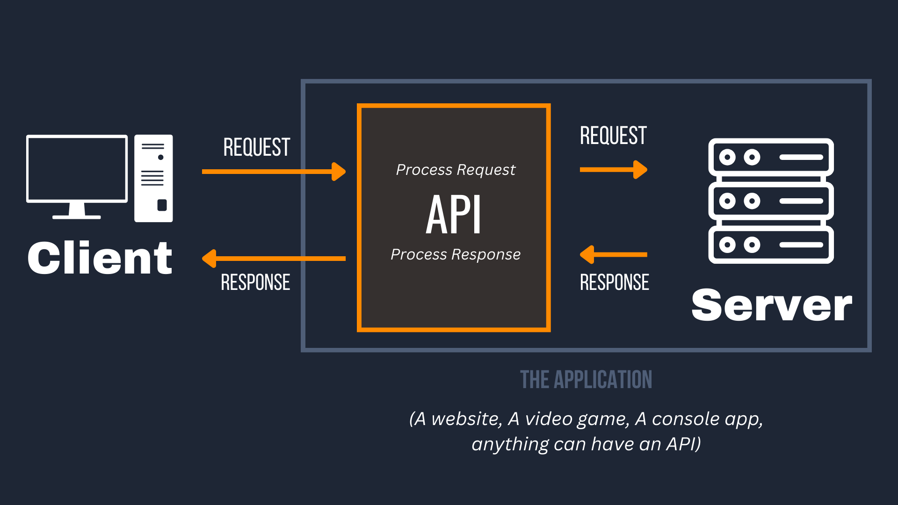

# Manual de Usuarios - Guía de Inicio Rápita

## 1. Requisitos del Sistema 
- Navegador web moderno (Google Chrome, Mozilla Firefox, Microft Edge).
- Conexion a la red local de la empresa.
- Entorno de Ejecucioion Python 3.10 o superior instalado.

## 2. Pasos para Iniciar la Aplicación 
1. Abrir la terminal o consola de comandos del sistema operativo.
2. Navegador a la carpeta raiz del proyecto y ejecutar el comando arranque:
    ```bash
    python main.py
    ```
3. Abrir el navegador e ingresar a la dirección web: `htpp://localhost:8080`

## 3. Flujo de Operación del Usuario 
> **Esquema Operativo:** A continuación se detalla el ciclo de interracción de los usuarios dentro de la plataforma.

```text
[Inicio de Sesión] ---> [Seleccionar Módulo] ---> [Procesar Datos] ---> [Cerrar Sesión]
```

## 4. Captura dee Pantalla del sistema
*(Assegúrate de guadar una imagen llamada `pantalla.png` dentro de la carpeta `docs/assets/` o usa una imagen de prueba)*.



## 5. NAvegación
- [Ver Arquitectura del Sistema](arquitectura.md)
- [volver al README Principal](../README.md)