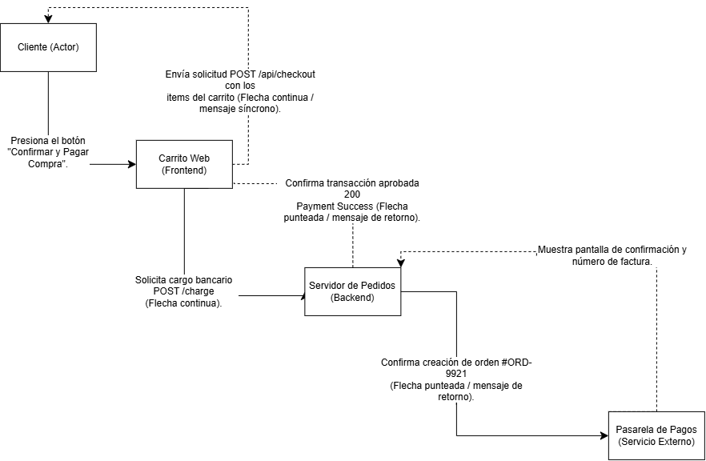

# Especificación de Secuencia: Autenticación de Usuario

## 1. Contextodel flujo
Se describe la interacción temporal entre la interfaz móvil, la API backend y la base de datos para la validación de credenciales.

## 2. Diagrama UML de secuencia

## 3. Detalle de los Pasos
##3. Detalle de los Pasos

1. El usuario ingresa sus credenciales en la aplicación.
2. La aplicación envía una solicitud HTTP POST al servidor.
3. El servidor valida la información consultando la base de datos.
4. La base de datos responde con los datos del usuario.
5. El servidor genera y devuelve un token de sesión 200 OK
6. La aplicación muestra la pantalla principal